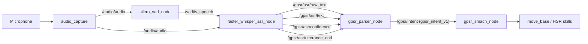
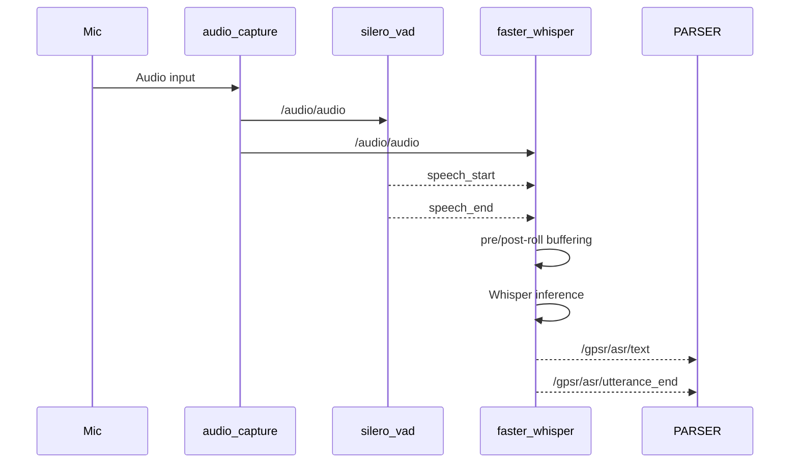
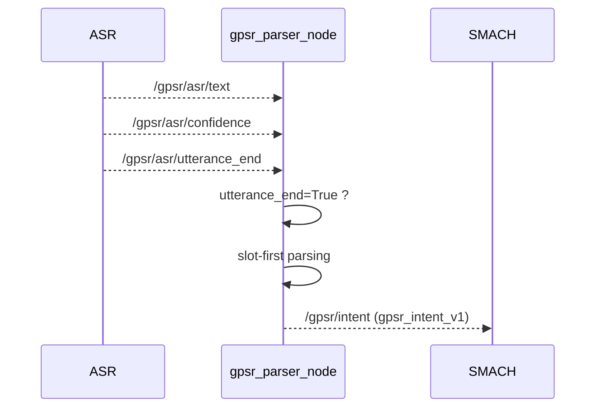
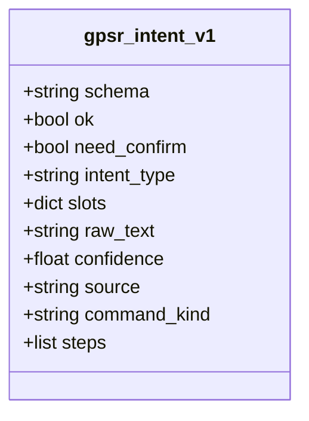
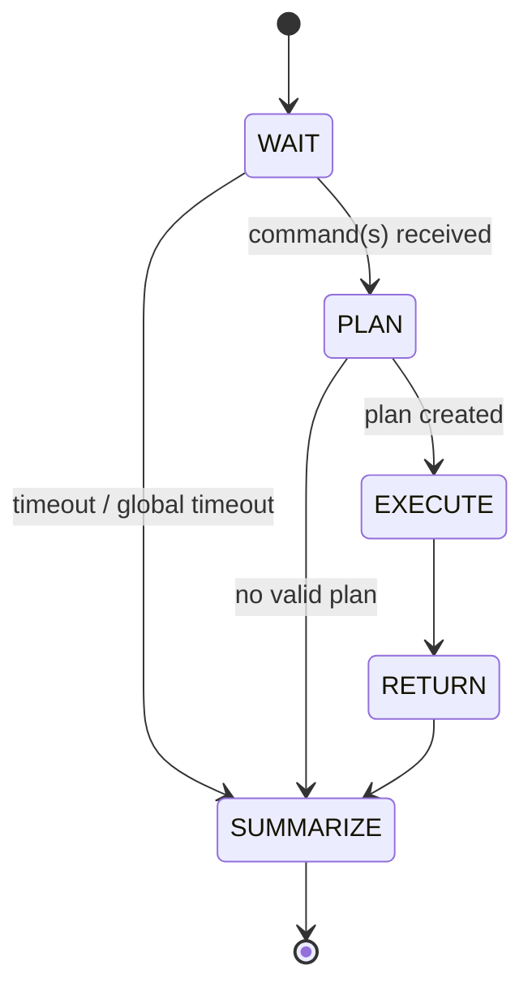
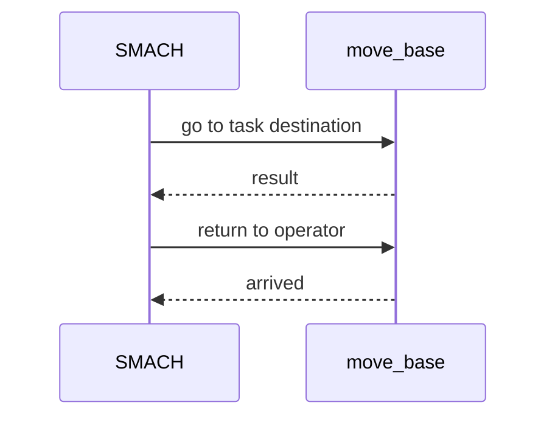
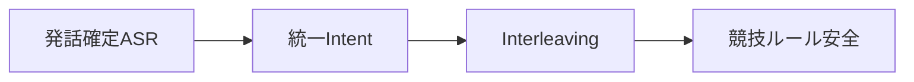

# RoboCup@Home GPSR System  
**Architecture & Execution Flow (Diagrammed Version)**  
*(HSR / ROS1 Noetic / Docker)*

---

## 1. システム概要

本システムは **RoboCup@Home GPSR (General Purpose Service Robot)** テストを  
**TOYOTA HSR + ROS1 Noetic + Docker** 環境で実行するための統合ソフトウェアである。

設計上の最重要方針は以下である。

- **発話確定（utterance_end）駆動**
- **Intent JSON スキーマの完全統一**
- **最大3コマンドの同時理解・計画（Interleaving）**
- **競技ルール（7分制限・Instruction Point 復帰）への厳密対応**

---

## 2. 全体アーキテクチャ図



---
### 設計方針
- 発話確定（utterance_end）駆動
  - ASRの途中結果で intent が暴発するのを防止

- 統一 JSON スキーマ
  - parser / intent 系の出力を完全に共通化

- 競技運用耐性
  - 聞き返し・誤認識・時間切れを明示的に扱う


## 3. 音声入力・ASR 処理フロー（Step 1）
### 使用ノード
- audio_capture
- silero_vad_node.py
- faster_whisper_asr_node.py

### 役割
ノード	役割
audio_capture	マイク入力を /audio/audio に publish
silero_vad_node	音声区間検出（speech / silence）
faster_whisper_asr_node	VAD終了時に Whisper で認識

### ASR出力トピック
トピック	内容
/gpsr/asr/raw_text	Whisper生出力
/gpsr/asr/text	GPSR向け正規化・補正後テキスト
/gpsr/asr/confidence	推定信頼度（0〜1）
/gpsr/asr/utterance_end	発話確定パルス

### 特徴
- VAD駆動（8秒固定切りではない）
- pre-roll / post-roll による語頭・語尾欠落防止
- 誤認識補正（food/foot 等）を常時適用



---

## 4. 発話確定駆動 Parser（Step 2）
### 使用ノード
- gpsr_parser_node.py
- （任意）gpsr_intent_node.py（バックアップ）

### 発話確定駆動
gpsr_parser_node は以下を購読します：

- /gpsr/asr/text
- /gpsr/asr/utterance_end
- /gpsr/asr/confidence

utterance_end=True が来た時のみ parse を実行します。



---

## 5. Intent 統一スキーマ（gpsr_intent_v1）
すべての /gpsr/intent は、以下の JSON 形式に統一されています。

### intent_type（SMACHが使用）
値	意味
bring	物体取得・搬送
guide	人物誘導
answer	質問応答・カウント
other	非対応・未分類



---

## 6. SMACH 実行フロー（Step 3）
### 使用ノード
- gpsr_smach_node.py

### 機能
- single / multi モード
  - single：1コマンドずつ処理
  - multi：最大3コマンド同時受領

- Interleaving
  - destination / room に基づく簡易グルーピング

- 7分制限
  - global_time_limit_sec（デフォルト 420秒）

- Instruction Point 復帰
  - operator_pose に基づき move_base 実行

主な状態遷移
```
WAIT_FOR_COMMANDS
   ↓
PLAN_INTERLEAVED
   ↓
EXECUTE_PLAN
   ↓
RETURN_TO_OPERATOR
   ↓
SUMMARIZE
```



---

## 7. Instruction Point 復帰



---

## 実行結果出力
トピック
- /gpsr/task_state
- /gpsr/result

/gpsr/result 例
```
{
  "schema": "gpsr_result_v1",
  "finish_reason": "completed",
  "time_limit": 420,
  "intents_received": [...],
  "plan": [...],
  "exec_results": [...]
}
```

## launch 構成
テスト用（音声〜intent）
```
roslaunch hsr_audio_pipeline gpsr_audio_intent_test.launch
```
実行用（SMACHまで）
```
roslaunch hsr_audio_pipeline gpsr_run.launch
```

## 運用時の推奨手順（競技）
1. dry_run_nav:=true で音声〜intent確認
2. ASR誤認識・語彙を correction 辞書に反映
3. room_pose_map を会場に合わせて設定
4. dry_run_nav:=false に切替
5. 本番運用

## 10. 今後の拡張ポイント
- Interleaving を 移動コスト最小化で最適化
- bring / guide / answer を HSR 実機APIに接続
- 人物認識・人数カウント・VQAの統合
- GPSR CommandGenerator 完全準拠テンプレ追加

## 8. まとめ


