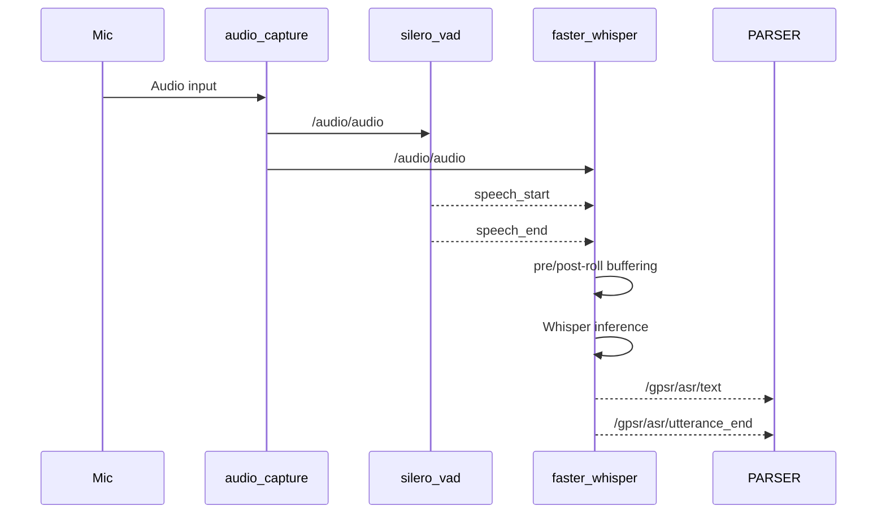
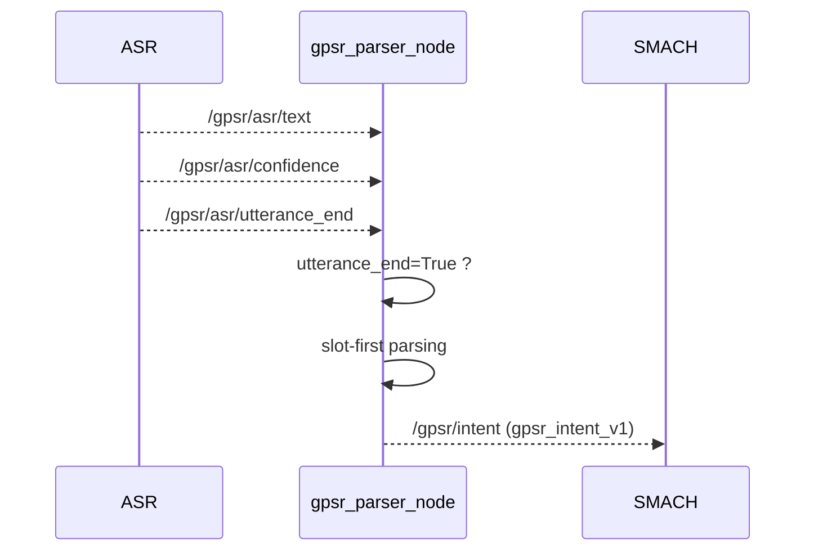
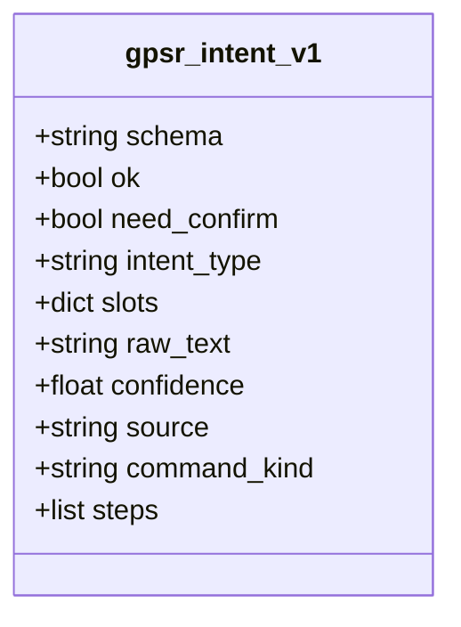
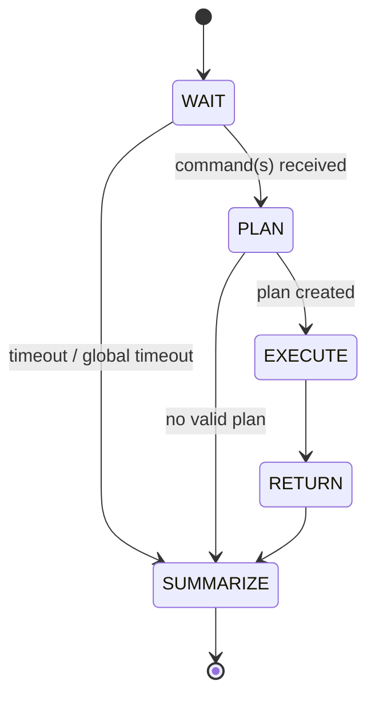
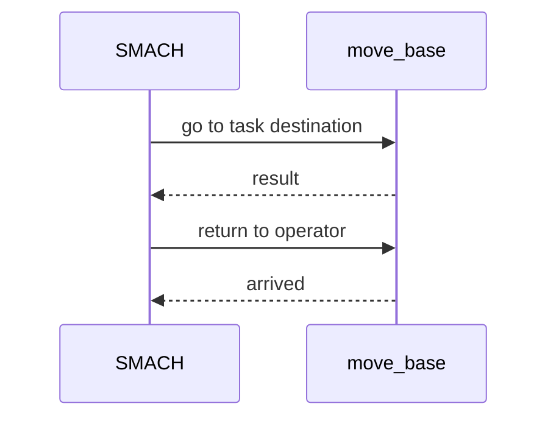
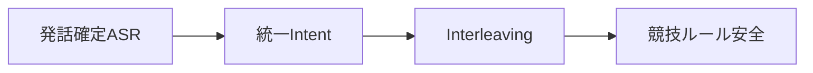

# RoboCup@Home GPSR System  
**Architecture & Execution Flow (Diagrammed Version)**  
*(HSR / ROS1 Noetic / Docker)*

---

## 1. システム概要

本システムは **RoboCup@Home GPSR (General Purpose Service Robot)** テストを  
**TOYOTA HSR + ROS1 Noetic + Docker** 環境で実行するための統合ソフトウェアである。

設計上の最重要方針は以下である。

- **発話確定（utterance_end）駆動**
- **Intent JSON スキーマの完全統一**
- **最大3コマンドの同時理解・計画（Interleaving）**
- **競技ルール（7分制限・Instruction Point 復帰）への厳密対応**

---

## 2. 全体アーキテクチャ図

```mermaid
flowchart LR
    Mic[Microphone]
    AC[audio_capture]
    VAD[silero_vad_node]
    ASR[faster_whisper_asr_node]
    PARSER[gpsr_parser_node]
    SMACH[gpsr_smach_node]
    NAV[move_base / HSR skills]

    Mic --> AC
    AC -->|/audio/audio| VAD
    VAD -->|/vad/is_speech| ASR
    AC -->|/audio/audio| ASR

    ASR -->|/gpsr/asr/raw_text| PARSER
    ASR -->|/gpsr/asr/text| PARSER
    ASR -->|/gpsr/asr/confidence| PARSER
    ASR -->|/gpsr/asr/utterance_end| PARSER

    PARSER -->|/gpsr/intent (gpsr_intent_v1)| SMACH
    SMACH --> NAV
```
---
### 設計方針
- 発話確定（utterance_end）駆動
  - ASRの途中結果で intent が暴発するのを防止

統一 JSON スキーマ

parser / intent 系の出力を完全に共通化

競技運用耐性

聞き返し・誤認識・時間切れを明示的に扱う


## 3. 音声入力・ASR 処理フロー（Step 1）



---

## 4. 発話確定駆動 Parser（Step 2）



---

## 5. Intent 統一スキーマ（gpsr_intent_v1）



---

## 6. SMACH 実行フロー（Step 3）



---

## 7. Instruction Point 復帰



---

## 8. まとめ


